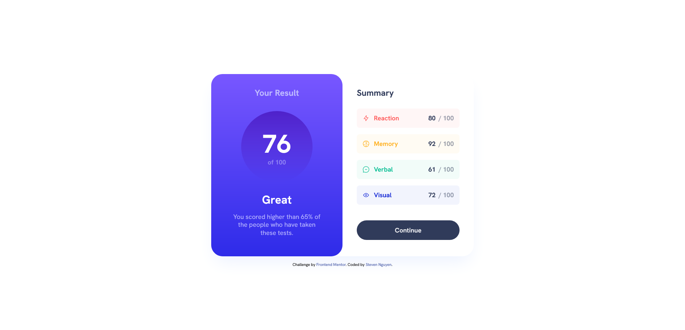
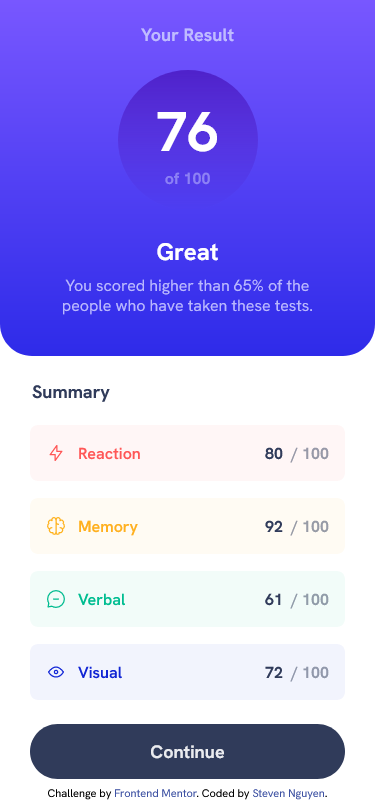

# Frontend Mentor - Results summary component solution

This is a solution to the [Results summary component challenge on Frontend Mentor](https://www.frontendmentor.io/challenges/results-summary-component-CE_K6s0maV). Frontend Mentor challenges help you improve your coding skills by building realistic projects.

## Table of contents

- [Overview](#overview)
  - [The challenge](#the-challenge)
  - [Screenshot](#screenshots)
  - [Links](#links)
- [My process](#my-process)
  - [Built with](#built-with)
  - [What I learned](#what-i-learned)
  - [Continued development](#continued-development)
  - [Useful resources](#useful-resources)
- [Author](#author)

## Overview

### The challenge

Users should be able to:

- View the optimal layout for the interface depending on their device's screen size
- See hover and focus states for all interactive elements on the page
- **Bonus**: Use the local JSON data to dynamically populate the content

## Screenshots

### Desktop Screenshot



### Mobile Screenshot



### Links

- Solution URL: https://github.com/snguyen56/results-summary-react-tailwind
- Live Site URL: https://snguyen56.github.io/results-summary-react-tailwind/

## My process

### Built with

- Semantic HTML5 markup
- Mobile-first workflow
- Utility-first workflow
- [React](https://reactjs.org/) - JS library
- [Vite](https://vitejs.dev/) - Build Tool
- [Tailwind CSS](https://tailwindcss.com/) - For styles
- [Github Pages](https://pages.github.com/) - Hosting

### What I learned

I was able to gain experience with mobile-first workflow and how it works with the Tailwind library. I also gained knowledge on how assets were handled with Vite through the dynamic imports from the JSON file. The imports from my public folder were not working when using dynamic imports from a JSON file when I added a base URL for deployment, but I was able to fix the problem after going through the Vite documentation.

Below you can see the code before and after the issue was resolved:

```JSX

```

```JSX

```

### Continued development

I will continue to try and adhere to the mobile first workflow to internalize the technique, as well as use TailwindCSS to better improve my skills with the library.

### Useful resources

- [Static Asset Handling | Vite](https://vitejs.dev/guide/assets.html) - For understand how assets are handled in Vite.
- [Building for Production | Vite](https://vitejs.dev/guide/build.html#public-base-path) - The documentation that helped to resolve the problem with my code in adding a base URL.
- [Deploying a Static Site | Vite](https://vitejs.dev/guide/static-deploy.html#github-pages) - If you wish to learn how to deploy a Vite app to Github Pages.

## Author

- Github - https://github.com/snguyen56
- LinkedIn - [Steven Nguyen](https://www.linkedin.com/in/steven-nguyen-bb5568216/)
- Frontend Mentor - [@snguyen56](https://www.frontendmentor.io/profile/snguyen56)
